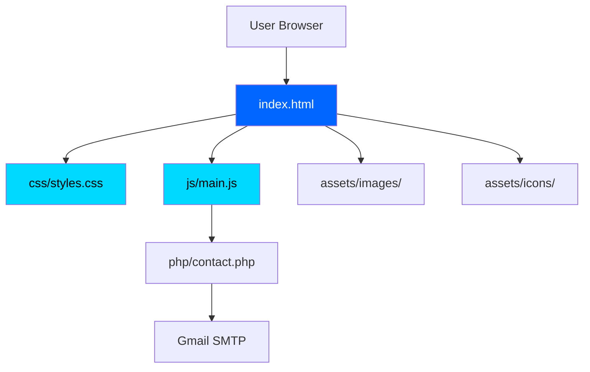
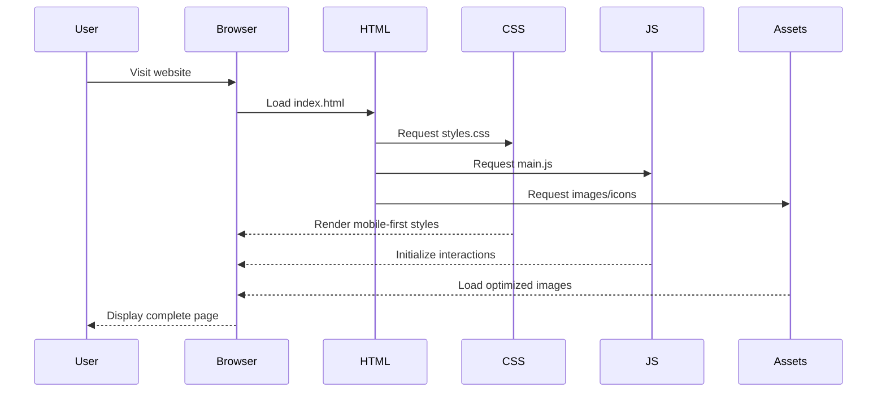
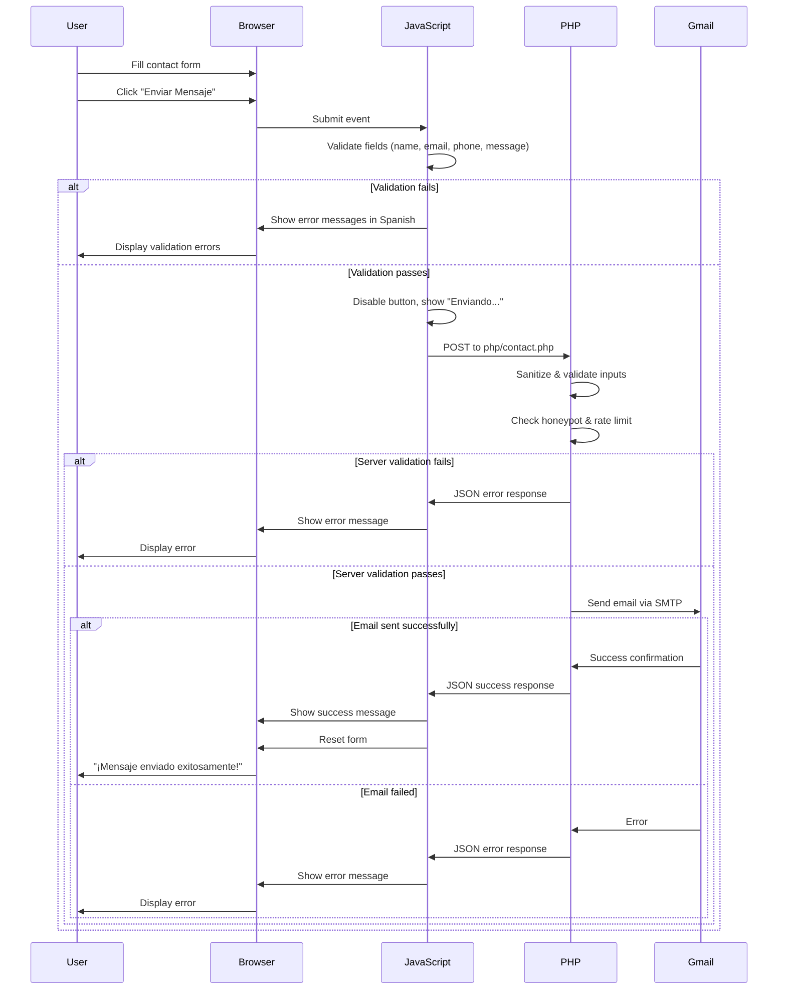

# Outrun AI Website - Architecture Documentation

## Introduction

This document serves as a visual map for the Outrun AI website, providing comprehensive documentation for easy navigation and future modifications.

- **Project**: Outrun AI - WhatsApp Automation for Clinics
- **Technology Stack**: HTML5, CSS3, Vanilla JavaScript
- **Target Audience**: Colombian aesthetic/dental clinics in Medellín
- **Hosting**: Hostinger VPS (shared with N8N automations)

---

## Visual Folder Structure

```
OutrunAI_Website/
├── index.html              # Main entry point
├── ARCHITECTURE.md         # This file - visual map
├── README.md               # Deployment instructions
├── .gitignore              # Git ignore rules
├── css/
│   └── styles.css          # Main stylesheet (mobile-first)
├── js/
│   └── main.js             # Interactive functionality
├── assets/
│   ├── images/             # Photos, graphics, founder image
│   │   └── .gitkeep
│   └── icons/              # SVG icons for services
│       └── .gitkeep
└── php/
    ├── contact.php         # Contact form handler
    ├── config.php          # SMTP credentials (gitignored)
    └── config.example.php  # Config template for setup
```

---

## File Purposes

| File | Purpose | Dependencies |
|------|---------|--------------|
| `index.html` | Main HTML structure, SEO meta tags | `styles.css`, `main.js` |
| `css/styles.css` | Mobile-first responsive styles | None |
| `js/main.js` | Interactive features, form validation | None (vanilla JS) |
| `php/contact.php` | Contact form email handler | Gmail SMTP via PHPMailer |
| `php/config.php` | SMTP credentials (gitignored) | None |
| `php/config.example.php` | Configuration template | None |
| `assets/images/` | Image assets (founder, testimonials, OG image) | None |
| `assets/icons/` | SVG icons for services section | None |

---

## Component Relationships Diagram



---

## Section Breakdown

All sections are defined in `index.html` with semantic HTML5 elements:

| Section ID | Purpose | Content |
|------------|---------|---------|
| `#hero` | Landing section | Value proposition, main CTA |
| `#servicios` | Services section | 5 service cards for clinic types with icons |
| `#consultoria` | Consultation CTA | Paid consultation booking |
| `#contacto` | Contact form | Gmail integration form |
| `#testimonios` | Client reviews | Customer testimonials |
| `#fundador` | Founder bio | About the founder |
| `footer` | Footer | Copyright and links |

---

## CSS Architecture

### Custom Properties (Variables)

Defined in `:root` for consistent theming:

```css
--primary-color: #0066FF      /* Trust-inspiring blue */
--secondary-color: #00D9FF    /* Modern accent */
--text-dark: #1a1a1a
--text-light: #666666
--background-light: #FFFFFF
--background-gray: #F5F7FA
--success-color: #10B981
--error-color: #EF4444
```

### Mobile-First Breakpoints

| Breakpoint | Target | Usage |
|------------|--------|-------|
| Base | 320px+ | Mobile styles (default) |
| `768px` | Tablet | Increased spacing, layout adjustments |
| `1024px` | Desktop | Full navigation, multi-column layouts |
| `1440px` | Large Desktop | Maximum container width |

### Utility Classes

- `.container` - Max-width wrapper with auto margins
- `.section` - Standard section padding
- `.section-title` - Centered heading styles

---

## JavaScript Modules

### Utility Functions

| Function | Purpose |
|----------|---------|
| `debounce(func, wait)` | Optimize scroll/resize events |
| `throttle(func, limit)` | Rate-limit performance-critical events |
| `isInViewport(element)` | Check element visibility |

### Form Validation

| Function | Purpose |
|----------|---------|
| `validateEmail(email)` | Email format validation |
| `validatePhone(phone)` | Colombian phone number validation |
| `showMessage(type, message)` | Display success/error messages |

### Features

| Function | Purpose |
|----------|---------|
| `initLazyLoading()` | Intersection Observer for images |
| `initMobileMenu()` | Hamburger menu toggle |
| `initSmoothScroll()` | Enhanced anchor link scrolling |
| `initContactForm()` | Contact form validation & AJAX submission |

---

## SEO Configuration

### Meta Tags

| Tag | Value | Purpose |
|-----|-------|---------|
| `lang` | `es` | Spanish language |
| `description` | 150-160 chars | Search result snippet |
| `keywords` | Medellín clinics | Target keywords |
| `robots` | `index, follow` | Search indexing |

### Geo-Targeting

| Tag | Value | Purpose |
|-----|-------|---------|
| `geo.region` | `CO-ANT` | Antioquia, Colombia |
| `geo.placename` | `Medellín` | City targeting |
| `geo.position` | `6.2442;-75.5812` | Coordinates |

### Open Graph Tags

| Tag | Purpose |
|-----|---------|
| `og:title` | Social share title |
| `og:description` | Social share description |
| `og:type` | `website` |
| `og:locale` | `es_CO` |
| `og:image` | Share image preview |

---

## Performance Considerations

### Optimization Strategies

- **CSS**: Mobile-first approach, CSS containment
- **JavaScript**: Deferred loading, debounce/throttle
- **Images**: Lazy loading with Intersection Observer
- **Fonts**: System font stack fallback

### VPS Hosting Notes

- Shared resources with N8N automations
- Minimal CPU/memory footprint required
- Static file serving for maximum speed

### Target Metrics

| Metric | Target |
|--------|--------|
| First Contentful Paint | < 1.5s |
| Largest Contentful Paint | < 2.5s |
| Total Page Size | < 500KB |
| Time to Interactive | < 3s |
| Mobile Performance Score | > 90 |

### Image Optimization Guidelines

- Use WebP format with JPEG fallback
- Compress images to < 100KB where possible
- Serve responsive images with `srcset`
- Include `width` and `height` attributes

---

## Future Enhancements

### Icon Sources

- Service icons: Custom SVG icons in `assets/icons/` (clinica-estetica.svg, ortodoncia.svg, dentista.svg, dermatologo.svg, cirugia-plastica.svg)

### Planned Features

- [x] `php/contact.php` - Gmail SMTP integration ✓
- [ ] WhatsApp button integration
- [ ] Google Analytics tracking
- [ ] Cookie consent banner
- [ ] Multi-language support (if needed)

### Scalability Considerations

- Current vanilla JS approach is sufficient for landing page
- Consider framework migration only if adding complex interactivity
- Keep PHP backend minimal - offload to N8N where possible

---

## Quick Reference Commands

### Local Development

```bash
# Start local server (Python 3)
python -m http.server 8000

# Start local server (Node.js)
npx serve

# Open in browser
http://localhost:8000
```

### Deployment to Hostinger VPS

```bash
# SSH into VPS
ssh user@your-vps-ip

# Navigate to web directory
cd /var/www/outrunai

# Pull latest changes
git pull origin main

# Set permissions
chmod -R 755 /var/www/outrunai
```

### Content Updates

1. Edit `index.html` for text/structure changes
2. Edit `css/styles.css` for visual changes
3. Add images to `assets/images/`
4. Test locally before deploying

---

## Data Flow Diagram



---

## Spanish Language & Colombia SEO Checklist

- ✅ `lang="es"` attribute on HTML tag
- ✅ Spanish meta description (150-160 characters)
- ✅ Keywords targeting Medellín clinics
- ✅ Geo-targeting meta tags (CO-ANT region)
- ✅ Medellín coordinates in geo.position
- ✅ `og:locale="es_CO"` for social sharing
- ✅ Spanish content throughout all sections
- ✅ Colombian phone number format validation

---

---

## Contact Form Flow

The contact form implements a complete client-server validation flow with Gmail SMTP integration:



### Contact Form Configuration

**Environment Variables (in `php/config.php`):**

| Variable | Description |
|----------|-------------|
| `SMTP_HOST` | Gmail SMTP server (smtp.gmail.com) |
| `SMTP_PORT` | SMTP port (587 for TLS) |
| `SMTP_USERNAME` | Your Gmail address |
| `SMTP_PASSWORD` | Gmail App Password (16 chars) |
| `CONTACT_EMAIL` | Email to receive messages |
| `ALLOWED_REFERER` | Domain for CSRF protection |

### Security Features

- **Honeypot field**: Hidden field to catch bots
- **Rate limiting**: 5 requests per hour per IP
- **Input sanitization**: `htmlspecialchars()` and `strip_tags()`
- **CSRF protection**: Referer header validation
- **Server-side validation**: Duplicate of client-side checks

### Gmail App Password Setup

1. Go to Google Account → Security
2. Enable 2-Step Verification
3. Go to "App passwords" section
4. Select "Mail" and "Other (Custom name)"
5. Enter "Outrun AI Website" as the name
6. Copy the 16-character password to `config.php`

### Troubleshooting

| Issue | Solution |
|-------|----------|
| "Connection refused" | Check SMTP_PORT (587 for TLS, 465 for SSL) |
| "Authentication failed" | Verify App Password, not regular password |
| "Less secure app" error | Use App Password with 2FA enabled |
| Emails in spam | Configure SPF/DKIM records in DNS |
| Rate limit errors | Wait 1 hour or check rate limit file in temp |

---

*Last updated: January 2026*
